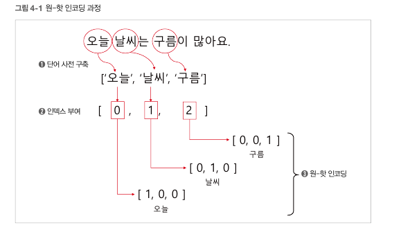
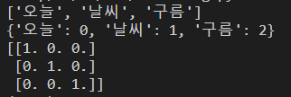
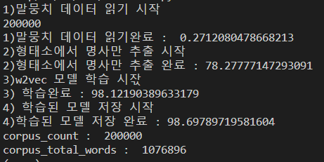

# 토크나이징

- 자연어를 컴퓨터가 효율적으로 이해 시키기위한 방법
- 어떤 문장을 일정한 의미기ㅏ 있는 가장 작은 단어들로 나눔
- 그 다음 나눠진 단어들을 이용해 의미를 분석, 여기서 가장 기본이 되는 단어들을 토큰 이라고 함
- 이렇게 주어진 문장에서 토큰 단위로 정보를 나누는 작업을 토크나이징이라고 함

## KoNLPy

- 한국어 자연어 처리에 많이 사용하는 파이썬 라이브러리

- 한국어 단어들을 9품사로 나눔

- 다음 세가지 형태소 분석기 모델
1. Kkma

```python
from konlpy.tag import Kkma, Komoran


kkma = Kkma()
text = '아버지가 방에 들어갑니다.'

morphs = kkma.morphs(text) ## 형태소 단위로 토크나이징
print(morphs)

pos = kkma.pos(text) ## 태깅
print(pos)

nouns = kkma.nouns(text)

sentence = '오늘 날씨는? 어때요? 내일은 덥다던데.'
s = kkma.sentences(sentence) ## 문장단위로 바꿔줌
print(s)
```

2. Okt

```python
from konlpy.tag import Kkma, Komoran, Okt


okt =Okt()
text = '아버지가 방에 들어갑니다.'

morphs = okt.morphs(text)
print(morphs)

pos = okt.pos(text)
print(pos)

nouns = okt.nouns(text)
print(nouns)

text = '오늘 날씨가 좋아욬ㅋㅋ'
print(okt.normalize(text)) ### 정규화 , 오탈자나 비문을 바꿔줌
print(okt.phrases(text))
```

3. Komoran

```python
from konlpy.tag import Kkma, Komoran, Okt
komoran = Komoran(userdic='./user_dic.txt') ### 사용자 사전 구축
text = '우리 챗봇은 엔엘피를 좋아해'
pos = komoran.pos(text) 
print(pos)
```

# 임베딩

- 컴퓨터는 수치 연산만 가능하기 때문에 자연어를 숫자나 벡터형태로 변환할 필요가 있다
- 이러한 과정을 임베딩이라고 함

## 원-핫 인코딩

- 단어를 숫자 벡터로 변환하는 가장 기본적인 방법



```python
from konlpy.tag import Komoran
import numpy as np

komoran = Komoran()
text = '오늘 날씨는 구름이 많아요.'

# 명사만 추출
nouns = komoran.nouns(text)
print(nouns)

dics = {}
for word in nouns:
    if word not in dics.keys():
        dics[word] = len(dics)

print(dics)

# 원-핫 인코딩
nb_classes = len(dics)
targets = list(dics.values())
one_hot_targets = np.eye(nb_classes)[targets]
print(one_hot_targets)
```



## 희소 표현과 분산 표현

- 하나의 단어의 인덱스 요소만 1이고 나머지 요소는 모두 0으로 표현되는것을 희소표현
- 서로 단어와의 연관성등으로 표현 한 것을 분산 표현, 즉 단어간의 유사도를 이용함
- 예를 들면 색상을 나타낼떄 연두색만 따로 지정하는 것보다 RGB(204,255,204) 형태로 저장 시키는것이 훨씬 효율 적임

# Word2Vec

- 분산 표현 형태의 단어 임베딩 모델
- CBOW 와 skip-gram 두가지 모델
- CBOW모델은 맥락이라 표현되는 주변 단어들을 이용해 타깃 단어를 예측하는 신경망 모델
- skip-gram 모델은 하나의 타깃단어를 이용해 주변 단어들을 예측

```python
from gensim.models.word2vec import Word2Vec
from konlpy.tag import Komoran
import time

def read_review_data(filename):
    with open(filename, 'r', encoding='UTF8') as f:
        data = [line.split('\t') for line in f.read().splitlines()]
        data = data[1:]
    return data

start = time.time() 

print('1)말뭉치 데이터 읽기 시작')
review_data = read_review_data('./ratings.txt')
print(len(review_data))
print('1)말뭉치 데이터 읽기완료 : ', time.time() - start)

print('2)형태소에서 명사만 추출 시작')
komoran = Komoran()
docs = [komoran.nouns(sentence[1]) for sentence in review_data]
print('2)형태소에서 명사만 추출 완료 :', time.time() - start)

print('3)w2vec 모델 학습 시잓')
model = Word2Vec(sentences=docs, vector_size=200, window=4, hs=1, min_count=2, sg=1)
print('3) 학습완료 :', time.time() - start)

print('4) 학습된 모델 저장 시작')
model.save('nvmc.model')
print('4)학습된 모델 저장 완료 :', time.time() - start)

print("corpus_count : ", model.corpus_count)
print("corpus_total_words : ", model.corpus_total_words)
```



### Word2Vec 모델 활용

```python
from gensim.models import Word2Vec

# 모델 로딩
model = Word2Vec.load('nvmc.model')
print("corpus_total_words:",model.corpus_total_words)

# 사랑 이란 단어로 생성한 단어 임베딩 벡터
print('사랑 : ', model.wv['사랑'])

# 단어 유사도 계산
print('일요일 = 월요일\t', model.wv.similarity(w1='일요일',w2='월요일'))
print('안성기 = 배우\t', model.wv.similarity(w1='안성기',w2='배우'))
print('대기업 = 삼성\t', model.wv.similarity(w1='대기업',w2='삼성'))
print('일요일 != 삼성\t', model.wv.similarity(w1='일요일',w2='삼성'))
print('히어로 != 삼성\t', model.wv.similarity(w1='히어로',w2='삼성'))

# 가장 유사한 단어 추출
print(model.wv.most_similar('안성기', topn =5))
print(model.wv.most_similar('시리즈', topn =5))
```