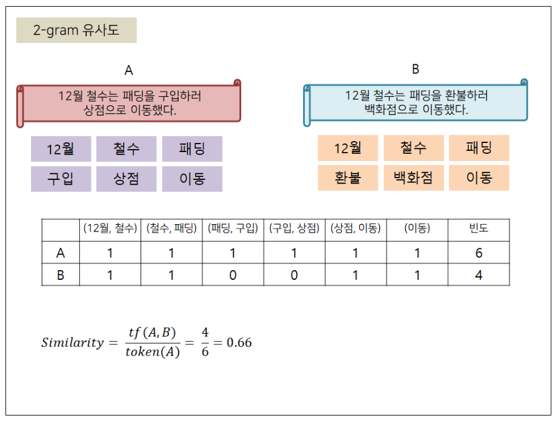

# 텍스트 유사도

- 두 문장이 얼마나 유사한지 계산하는것
1. n-gram 유사도
- n개의 단어를 토큰으로 사용



```python
from konlpy.tag import Komoran

# 어절 단위 n-gram
def word_ngram(bow,num_gram):
    text = tuple(bow)
    ngrams = [text[x:x + num_gram] for x in range(0, len(text))]
    return tuple(ngrams)

# 유사도 계산
def similarity(doc1, doc2):
    cnt = 0
    for token in doc1:
        if token in doc2:
            cnt += 1
    return cnt/len(doc1)

# 문장 정의
sentence1 = '12월 철수는 패딩을 구입하러 상점으로 이동했다.'
sentence2 = '12월 철수는 패딩을 환불하러 상점으로 이동했다.'
sentence3 = '철수는 패딩을 환불하러 상점으로 이동했다.'

# 형태소 분석기에서 명사(단어) 추출
komoran = Komoran()
bow1 = komoran.nouns(sentence1)
bow2 = komoran.nouns(sentence2)
bow3 = komoran.nouns(sentence3)


# 단어 n-gram 토큰 추출
doc1 = word_ngram(bow1, 2) # 2-gram 방식으로 추출
doc2 = word_ngram(bow2, 2) # 2-gram 방식으로 추출
doc3 = word_ngram(bow3, 2) # 2-gram 방식으로 추출


# 추출된 n-gram 토큰 출력
print(doc1)
# (('12월', '철수'), ('철수', '패딩'), ('패딩', '구입'), ('구입', '상점'), ('상 점', '이동'), ('이동',))
print(doc2)
# (('12월', '철수'), ('철수', '패딩'), ('패딩', '환불'), ('환불', '상점'), ('상 점', '이동'), ('이동',))
print(doc3)
# (('철수', '패딩'), ('패딩', '환불'), ('환불', '상점'), ('상점', '이동'), ('이 동',))

# 유사도 계산
r1 = similarity(doc1,doc2)
r2 = similarity(doc1,doc3)

# 계산된 유사도 출력
print(r1)
# 0.66
print(r2)
# 0.5
```

- 어떻게 쓰는지 잘 몰라서

```python
sentence3 = '철수는 패딩을 환불하러 상점으로 이동했다.'
```

를 추가 해보았다

- 동일한 묶음? 이 다른 문장에 얼마나 있는지 계산하는 거였다는 것을 알 수 있었다
2. 어어코사인 유사도


```python
from konlpy.tag import Komoran
import numpy as np
from numpy import dot
from numpy.linalg import norm

# 코사인 유사도 계산
def cos_sim(vec1,vec2):
    return dot(vec1,vec2) / (norm(vec1) * norm(vec2))

# tdm 만들기
def make_term_doc_mat(sentence_bow, word_dics):
    freq_mat = {}

    for word in word_dics:
        freq_mat[word] = 0

    for word in word_dics:
        if word in sentence_bow:
            freq_mat[word] += 1

    return freq_mat

# 단어 벡터 만들기
def make_vector(tdm):
    vec = []
    for key in tdm:
        vec.append(tdm[key])

    return vec


# 문장 정의
sentence1 = '12월 철수는 패딩을 구입하러 상점으로 이동했다.'
sentence2 = '12월 철수는 패딩을 환불하러 상점으로 이동했다.'
sentence3 = '철수는 패딩을 환불하러 상점으로 이동했다.'

# 형태소 분석기를 이용해 단어 묶음 리스트 생성
komoran = Komoran()
bow1 =komoran.nouns(sentence1)
bow2 =komoran.nouns(sentence2)
bow3 =komoran.nouns(sentence3)

# 단어 묶음 리스트를 하나로 합침
bow = bow1 + bow2 + bow3

# 단어 묶음에서 중복을 제거해 단어 사전 구축
word_dics = []
for token in bow:
    if token not in word_dics:
        word_dics.append(token)

freq_list1 = make_term_doc_mat(bow1,word_dics)
freq_list2 = make_term_doc_mat(bow2,word_dics)
freq_list3 = make_term_doc_mat(bow3,word_dics)
print(freq_list1)
print(freq_list2)
print(freq_list3)

doc1 = np.array(make_vector(freq_list1))
doc2 = np.array(make_vector(freq_list2))
doc3 = np.array(make_vector(freq_list3))

r1 = cos_sim(doc1,doc2)
r2 = cos_sim(doc3,doc1)

print(r1)
print(r2)
```

- 단순히 코사인 유사도 이용해서 계산하는거라 이해하기 어렵지는 않았다
