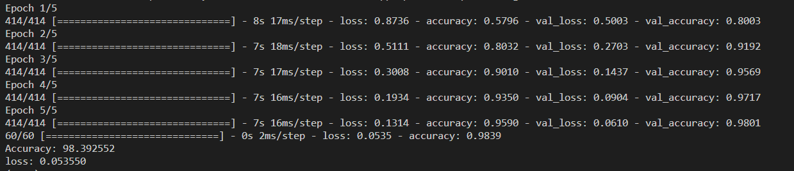
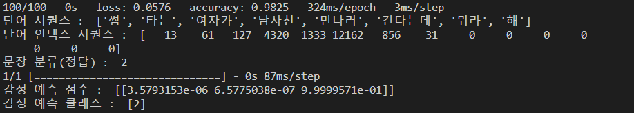

# CNN

- 합성곱 신경망, 이미지 분류에 좋은 성능

- 합성곱
  
  - 합성곱연산 : 합성곱 필터로 불리는 특정 크기의 행렬을 미지 데이터 행려에 슬라이딩하면서 곱하고 더하는 연산
  - 필터가 가중치 역할을 함
  - 스트라이드 : 필터 위치를 몇 칸 이동할지 결정하는 값
  - 패딩 : 합성곱 연산을 거칠 때마다 필터 크기와 스트라이드값에 따라 특징맵의 크기가 작아지는데 이를 방지하기 위해 패딩을 사용

- 풀링 연산
  
  - 합성곱 연산 결과로 나온 특징맵의 크기를 줄이거나 주요한 특징을 추출하기 위해 사용하는 연산
  - 보통 max-pooling 사용 : 윈도우크기 중에서 가장 큰값 만 가져오는것
  - 이렇게 해서 크기를 줄임
  - 오버피팅을 줄여주고, 연산 부하가 줄어듬

- TEXT에서 CNN은 channel이 1이다(그림은 보통 channel 이 3 (RGB때문), 흑백이면 1)

- 모델 생성

```python
# 필요한 모듈 임포트
import pandas as pd
import tensorflow as tf
from tensorflow.keras import preprocessing
from tensorflow.keras.models import Model
from tensorflow.keras.layers import Input, Embedding, Dense, Dropout, Conv1D, GlobalMaxPool1D, concatenate


# 데이터 읽어오기

train_file = "./chatbot/book_ex/ch6/chatbot_data.csv"
data = pd.read_csv(train_file, delimiter=',')
features = data['Q'].tolist()
labels = data['label'].tolist()

# 단어 인덱스 시퀀스 벡터

corpus = [preprocessing.text.text_to_word_sequence(text) for text in features]

tokenizer = preprocessing.text.Tokenizer()
tokenizer.fit_on_texts(corpus)
sequences = tokenizer.texts_to_sequences(corpus)
word_index = tokenizer.word_index
MAX_SEQ_LEN = 15  # 단어 시퀀스 벡터 크기
padded_seqs = preprocessing.sequence.pad_sequences(sequences, maxlen=MAX_SEQ_LEN, padding='post')

# 학습용, 검증용, 테스트용 데이터셋 생성 ➌

# 학습셋:검증셋:테스트셋 = 7:2:1

ds = tf.data.Dataset.from_tensor_slices((padded_seqs, labels))
ds = ds.shuffle(len(features))
train_size = int(len(padded_seqs) * 0.7)
val_size = int(len(padded_seqs) * 0.2)
test_size = int(len(padded_seqs) * 0.1)
train_ds = ds.take(train_size).batch(20)
val_ds = ds.skip(train_size).take(val_size).batch(20)
test_ds = ds.skip(train_size + val_size).take(test_size).batch(20)

# 하이퍼파라미터 설정

dropout_prob = 0.5
EMB_SIZE = 128
EPOCH = 5
VOCAB_SIZE = len(word_index) + 1  # 전체 단어 수

# CNN 모델 정의

input_layer = Input(shape=(MAX_SEQ_LEN,))

# 임베딩층

embedding_layer = Embedding(VOCAB_SIZE, EMB_SIZE, input_length=MAX_SEQ_LEN)(input_layer)
dropout_emb = Dropout(rate=dropout_prob)(embedding_layer)

# conv는 합성곱 필터와 연산

# pool 이 풀링(max_pooling)

conv1 = Conv1D(filters=128, kernel_size=3, padding='valid', activation=tf.nn.relu)(dropout_emb)
pool1 = GlobalMaxPool1D()(conv1)
conv2 = Conv1D(filters=128, kernel_size=4, padding='valid', activation=tf.nn.relu)(dropout_emb)
pool2 = GlobalMaxPool1D()(conv2)
conv3 = Conv1D(filters=128, kernel_size=5, padding='valid', activation=tf.nn.relu)(dropout_emb)
pool3 = GlobalMaxPool1D()(conv3)

# 3, 4, 5- gram 이후 합치기

concat = concatenate([pool1, pool2, pool3])
hidden = Dense(128, activation=tf.nn.relu)(concat)
dropout_hidden = Dropout(rate=dropout_prob)(hidden)
logits = Dense(3, name='logits')(dropout_hidden)
predictions = Dense(3, activation=tf.nn.softmax)(logits)

# 모델 생성

model = Model(inputs=input_layer, outputs=predictions)
model.compile(optimizer='adam', loss='sparse_categorical_crossentropy', metrics=['accuracy'])

# 모델 학습

model.fit(train_ds, validation_data=val_ds, epochs=EPOCH, verbose=1)

# 모델 평가(테스트 데이터셋 이용)

loss, accuracy = model.evaluate(test_ds, verbose=1)
print('Accuracy: %f' % (accuracy * 100))
print('loss: %f' % (loss))

# 모델 저장

model.save('cnn_model.h5')
```



- 모델 확인

```python
import tensorflow as tf
import pandas as pd
from tensorflow.keras.models import Model, load_model
from tensorflow.keras import preprocessing


# 데이터 읽어오기

train_file = "./chatbot/book_ex/ch6/chatbot_data.csv"
data = pd.read_csv(train_file, delimiter=',')
features = data['Q'].tolist()
labels = data['label'].tolist()

# 단어 인덱스 시퀀스 벡터

corpus = [preprocessing.text.text_to_word_sequence(text) for text in features]
tokenizer = preprocessing.text.Tokenizer()
tokenizer.fit_on_texts(corpus)
sequences = tokenizer.texts_to_sequences(corpus)
MAX_SEQ_LEN = 15 # 단어 시퀀스 벡터 크기
padded_seqs = preprocessing.sequence.pad_sequences(sequences, maxlen=MAX_SEQ_LEN, padding='post')

# 테스트용 데이터셋 생성

ds = tf.data.Dataset.from_tensor_slices((padded_seqs, labels))
ds = ds.shuffle(len(features))
test_ds = ds.take(2000).batch(20) # 테스트 데이터셋

# 감정 분류 CNN 모델 불러오기

model = load_model('cnn_model.h5')
model.summary()
model.evaluate(test_ds, verbose=2)

# 테스트용 데이터셋의 10212번째 데이터 출력

print("단어 시퀀스 : ", corpus[10212])
print("단어 인덱스 시퀀스 : ", padded_seqs[10212])
print("문장 분류(정답) : ", labels[10212])

# 테스트용 데이터셋의 10212번째 데이터 감정 예측

picks = [10212]
predict = model.predict(padded_seqs[picks])
predict_class = tf.math.argmax(predict, axis=1)
print("감정 예측 점수 : ", predict)
print("감정 예측 클래스 : ", predict_class.numpy())
```

