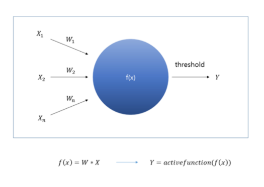
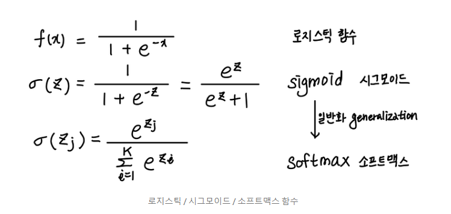
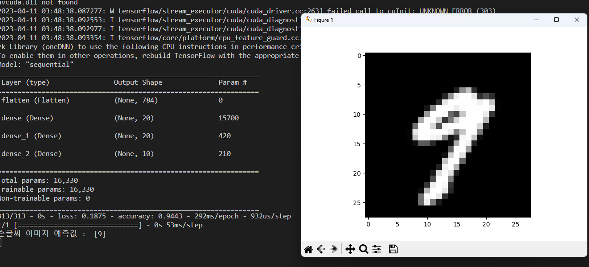
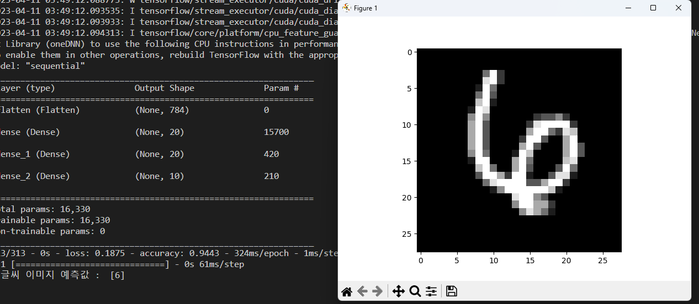

# 인공신경망



- f: R ^n -> R

- [w1,w2,...,wn] * [x1,x2,.. xn] 일때 각각의 가중치 wi 에 대한 함수 가 각각 존재한다

- 활성화 함수에는  스텝함수, 시그모이드 함수, ReLU함수등이 있다

- softmax 함수는 시그모이드 함수를 일반화 시킨것



- 단층 신경망 : 입력층과 출력층 으로만 구성된 단순한 신경망

- 심층 신경망 : 입력층과 1개 이상의 은닉층, 출력층으로 구성된 신경망

- 신경망 계층이 깊게 구성되어 각각의 뉴런을 학습 시킨다하여 딥러닝 모델이라 부릅니다.

- 입력층 -> 은닉층 -> 출력층 으로 이루어지는 방향을 순전파

- 이때 오차가 클때 오차를 줄어드는 방향으로 가중치등을 역으로 갱신해나가는 과정을 역전파(즉 오차가 줄어들도록 가중치를 줄여줌, 편미분등을 이용)

- 역전파를 통해 딥러닝 모델에서 학습이란 역전파를 이용해 오차를 최대한 줄일 수 있도록 가중치를 조정하는 과정

> ### 딥러닝 분류 모델  만들기

```python
import tensorflow as tf
import matplotlib.pyplot as plt
from tensorflow.keras.datasets import mnist
from tensorflow.keras.models import Sequential
from tensorflow.keras.layers import Flatten, Dense

# MNIST 데이터셋 가져오기
(x_train, y_train), (x_test, y_test) = mnist.load_data()
x_train, x_test = x_train / 255.0, x_test / 255.0 # 데이터 정규화

# tf.data를 사용하여 데이터셋을 섞고 배치 만들기
ds = tf.data.Dataset.from_tensor_slices((x_train, y_train)).shuffle(10000)
train_size = int(len(x_train) * 0.7) # 학습셋:검증셋 = 7:3

# 배치 사이즈는 학습시 샘플수를 의미, 배치 사이즈가 작을수록 가중치 갱신이 자주 일어난다
train_ds = ds.take(train_size).batch(20)
val_ds = ds.skip(train_size).batch(20)

# MNIST 분류 모델 구성
# 순차 모델을 사용
# 신경망 계층을 예제에서처럼 순차적으로 더해주기 때문, 가장 기본적인 방법
model = Sequential()

# 1개의 입력층
# flatten 게층은 28*28 크기의 2차원 이미지를 1차원으로 평탄화 시킴
model.add(Flatten(input_shape=(28, 28)))

# 2개의 은닉층
# 출력 크기가 20, 활성화 함수로 ReLU를 사용
model.add(Dense(20, activation='relu'))
model.add(Dense(20, activation='relu'))

# 1개의 출력층
# 출력층의 크기가 10(0~9)이기 때문
# softmax 함수는 입력받은 값을 출력으로 0~1 사이의 값으로 정규화한다
# 이중 가장 큰 출력값을 가지는 클래스가 결괏 값으로 사용된다
model.add(Dense(10, activation='softmax'))


# 모델 생성
model.compile(loss='sparse_categorical_crossentropy', optimizer='sgd', metrics=['accuracy'])
# model.compile(loss='categorical_crossentropy', optimizer='sgd', metrics=['accuracy'])

# 모델 학습
hist = model.fit(train_ds, validation_data=val_ds, epochs=10)

# 모델 평가
print('모델 평가')
model.evaluate(x_test, y_test)

# 모델 정보 출력
model.summary()

# 모델 저장
model.save('mnist_model.h5')

# 학습 결과 그래프 그리기
fig, loss_ax = plt.subplots()
acc_ax = loss_ax.twinx()
loss_ax.plot(hist.history['loss'], 'y', label='train loss')
loss_ax.plot(hist.history['val_loss'], 'r', label='val loss')
acc_ax.plot(hist.history['accuracy'], 'b', label='train acc')
acc_ax.plot(hist.history['val_accuracy'], 'g', label='val acc')
loss_ax.set_xlabel('epoch')
loss_ax.set_ylabel('loss')
acc_ax.set_ylabel('accuracy')
loss_ax.legend(loc='upper left')
acc_ax.legend(loc='lower left')
plt.show()
```


- 학습된 모델 사용하기

```python
from tensorflow.keras.datasets import mnist
from tensorflow.keras.models import load_model
import matplotlib.pyplot as plt


# MNIST 데이터셋 가져오기

_, (x_test, y_test) = mnist.load_data()
x_test = x_test / 255.0 # 데이터 정규화

# 모델 불러오기

model = load_model('mnist_model.h5')
model.summary()
model.evaluate(x_test, y_test, verbose=2)

# 테스트셋에서 20번째 이미지 출력

plt.imshow(x_test[20], cmap="gray")
plt.show()

# 테스트셋의 20번째 이미지 클래스 분류

picks = [20]
predict = model.predict_classes(x_test[picks])
print("손글씨 이미지 예측값 : ", predict)
```



