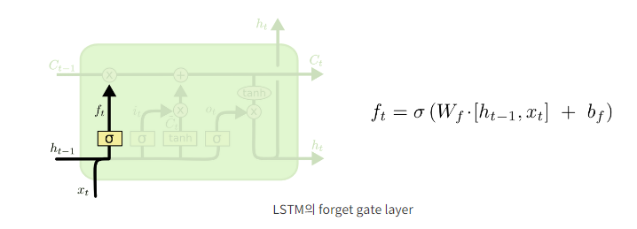
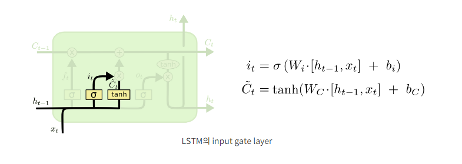
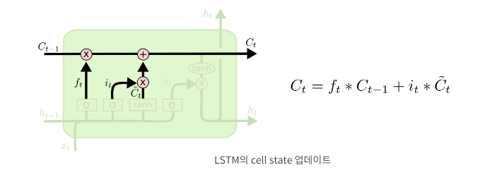
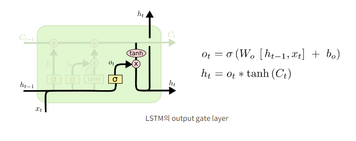
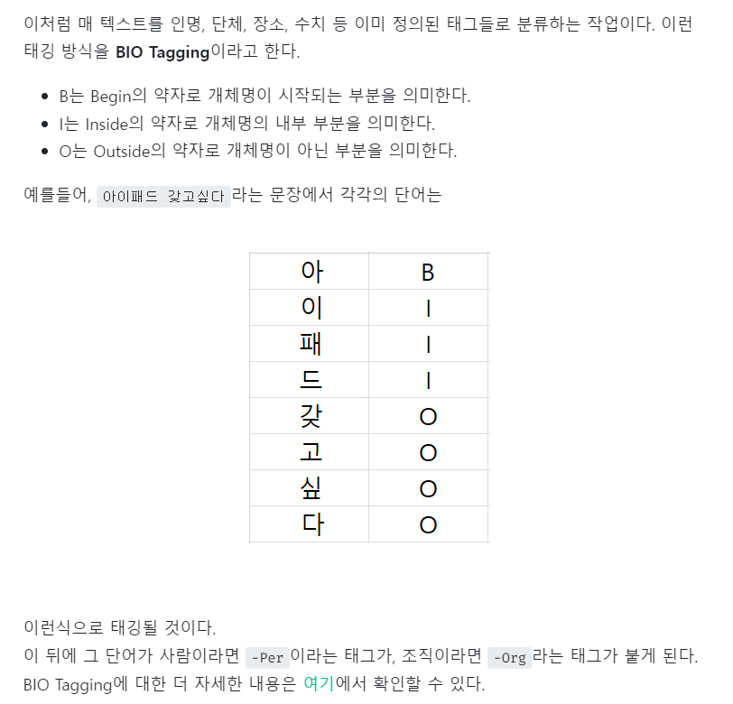

# LSTM

- RNN은 입력 시퀀스의 시점이 길어질수록 앞쪽의 데이터가 뒤쪽으로 잘 전달되지 않아 학습 능력이 떨어진다.
- RNN을 다층 구조로 쌓으면 입력과 출력 데이터 사이의 연관 관계가 줄어들어 장기 의존성 문제가 생긴다.
- 이런 문제를 보완하는 것이 LSTM
- LSTM은 4개의 구조로 되어 있다

1. LSTM의 첫 단계로는 cell state로부터 어떤 정보를 버릴 것인지를 정하는 것으로, sigmoid layer에 의해 결정된다. 그래서 이 단계의 gate를 "forget gate layer"라고 부른다
   
   이 단계에서는 ht−1과 xt를 받아서 0과 1 사이의 값을 Ct−1에 보내준다. 그 값이 1이면 "모든 정보를 보존해라"가 되고, 0이면 "죄다 갖다버려라"가 된다.

2. 다음 단계는 앞으로 들어오는 새로운 정보 중 어떤 것을 cell state에 저장할 것인지를 정한다. 먼저, "input gate layer"라고 불리는 sigmoid layer가 어떤 값을 업데이트할 지 정한다. 그 다음에 tanh layer가 새로운 후보 값들인 ~Ct 라는 vector를 만들고, cell state에 더할 준비를 한다. 이렇게 두 단계에서 나온 정보를 합쳐서 state를 업데이트할 재료를 만들게 된다.

3. 이제 과거 state인 Ct−1를 업데이트해서 새로운 cell state인 Ct를 만들 것이다. 이미 이전 단계에서 어떤 값을 얼마나 업데이트해야 할 지 다 정해놨으므로 여기서는 그 일을 실천만 하면 된다.
   
   우선 이전 state에 ft를 곱해서 가장 첫 단계에서 잊어버리기로 정했던 것들을 진짜로 잊어버린다. 그리고나서 it∗~Ct를 더한다. 이 더하는 값은 두 번째 단계에서 업데이트하기로 한 값을 얼마나 업데이트할 지 정한 만큼 scale한 값이 된다.
   
   또 다시 언어 모델 문제로 돌아가보면, 이 단계에서 실제로 이전 주어의 성별 정보를 없애고 새로운 정보를 더하게 되는데, 이는 지난 단계들에서 다 정했던 것들을 실천만 하는 단계임을 다시 확인할 수 있다.

4. 마지막으로 무엇을 output으로 내보낼 지 정하는 일이 남았다. 이 output은 cell state를 바탕으로 필터된 값이 될 것이다. 가장 먼저, sigmoid layer에 input 데이터를 태워서 cell state의 어느 부분을 output으로 내보낼 지를 정한다. 그리고나서 cell state를 tanh layer에 태워서 -1과 1 사이의 값을 받은 뒤에 방금 전에 계산한 sigmoid gate의 output과 곱해준다. 그렇게 하면 우리가 output으로 보내고자 하는 부분만 내보낼 수 있게 된다.

# 양방향 LSTM

- RNN이나 LSTM은 이전 시점의 정보만을 활용 할 수 밖에 없는 단점
- 기존 LSTM에 역방향 LSTM을 추가

# 개체명 인식

- 개체명 인식이란 문장 내에 포함된 어떤 단어가 인물, 장소, 날짜 등을 의미하는 단어인지 인식하는 것

