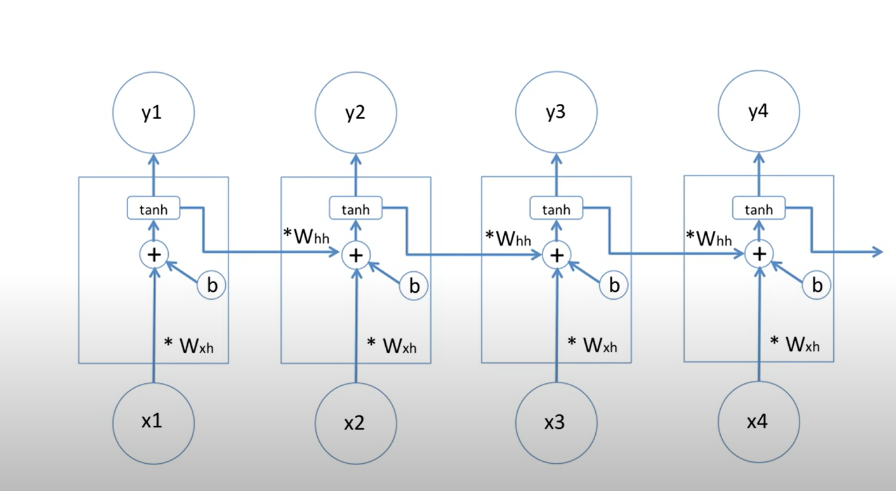
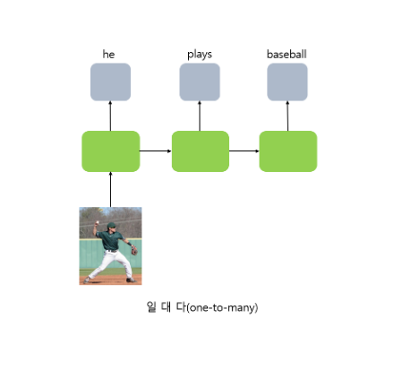
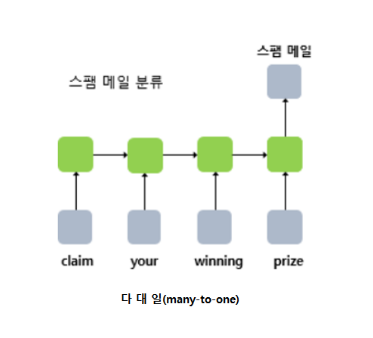
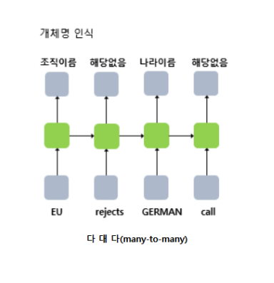

# RNN

- 순환 신경망으로 불림
- 은닉층 출력값의 출력층과 그 다음 시점의 은닉층 노드의 입력으로 전달해 순환하는 특징

- RNN 모델은 시퀀스나 시계열 데이터를 처리 한다

1. one - to - many

- 하나의 입력에 대해 여러개의 출력을 가지는 경우

2. many - to - one

- 입력 문서가 긍정적인지 부정적인지 판별하는 감성 분류 or 스펨메일인지 분류

3. many - to - many

- 시퀀스 입력에 대해 시퀀스 출력을 하는 다 대 다 모델(챗봇이나 번역기에 많이 쓰임)